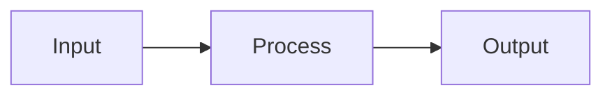

# docs/AGENTS.md

> Documentation subdirectory for God-Tier macOS Development Environment

## Context

This directory contains supplementary documentation for the macOS development environment project.

## Entry Points

| Priority | File | Purpose |
|----------|------|---------|
| 1 | [../AGENTS.md](../AGENTS.md) | Project knowledge base (start here) |
| 2 | [../llms.txt](../llms.txt) | Documentation index |
| 3 | [../CLAUDE.md](../CLAUDE.md) | AI assistant context |

## Files in This Directory

| File | Purpose | When to Read |
|------|---------|--------------|
| `AI_CODE_REVIEW.md` | AI-assisted code review setup | Setting up PR review bots |
| `WORKFLOWS.md` | Step-by-step task workflows | Executing common tasks |
| `AGENTS.md` | This file - subdirectory context | Working in docs/ |

## Editing Rules

1. **Use Mermaid for diagrams** - Flowcharts, sequence diagrams
2. **Keep consistent with root docs** - Follow AGENTS.md patterns
3. **Update ../llms.txt after changes** - Keep index current
4. **Validate with shellcheck** for any shell examples

## File Relationships

```
Root Documentation
├── AGENTS.md          ← Primary AI context (comprehensive)
├── CLAUDE.md          ← AI assistant patterns
├── llms.txt           ← Documentation index
├── README.md          ← User-facing setup guide
└── docs/
    ├── AGENTS.md      ← This file (local context)
    ├── WORKFLOWS.md   ← Task execution steps
    └── AI_CODE_REVIEW.md ← CI/CD integration
```

## Do Not

| Action | Why |
|--------|-----|
| Duplicate root AGENTS.md content | Link, don't copy |
| Add implementation code | This is documentation only |
| Create .html files | Generate from Markdown if needed |
| Modify without updating llms.txt | Keep index in sync |

## Adding New Documentation

1. Create `docs/<NAME>.md`
2. Add entry to this file's table
3. Add entry to `../llms.txt`
4. Add cross-reference in `../AGENTS.md` if appropriate

## Style Guide

### Headings
- H1: File title only
- H2: Major sections
- H3: Subsections
- H4: Details within subsections

### Tables
Use tables for:
- File listings
- Command references
- Configuration options
- Comparison matrices

### Code Blocks
```bash
# Always specify language
mise run validate
```

### Mermaid Diagrams


## Related Files

| File | Location | Relationship |
|------|----------|--------------|
| MANUAL.md | Root | User-facing system manual |
| PROJECT_PLAN.md | Root | Agile sprint planning |
| MIGRATION.md | Root | Migration from other tools |
| SECRETS.md | Root | Secrets management guide |
| SKYPILOT.md | Root | Cloud agent documentation |

---

*This file provides local context for AI agents working in the docs/ directory.*
