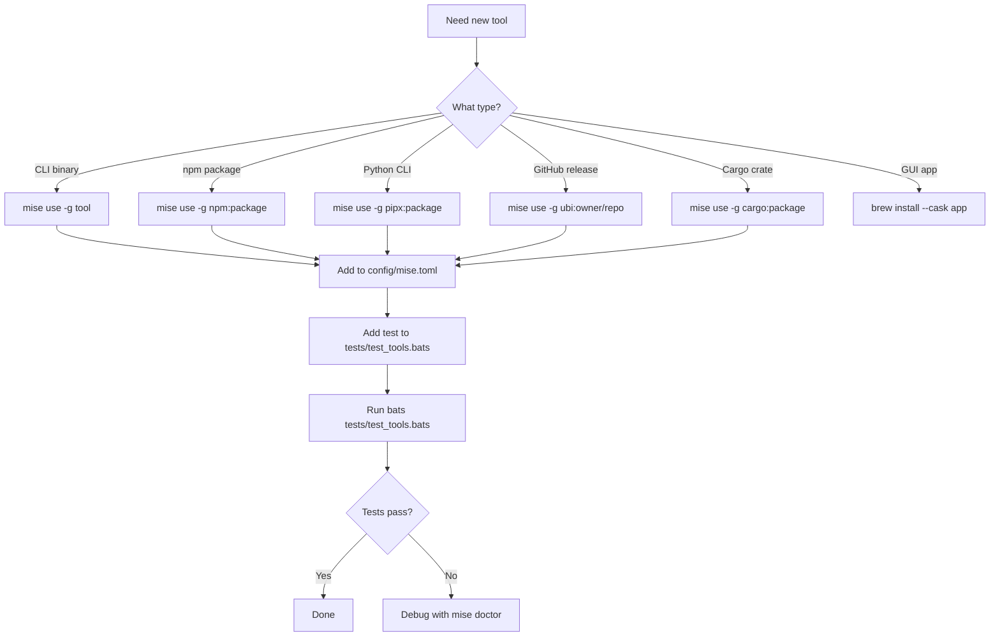
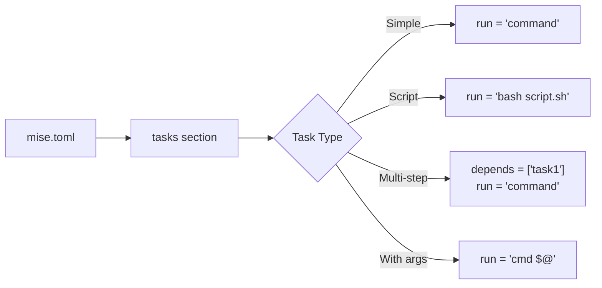
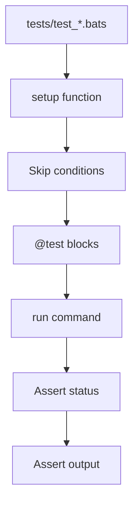
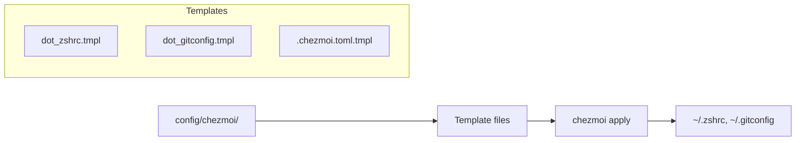
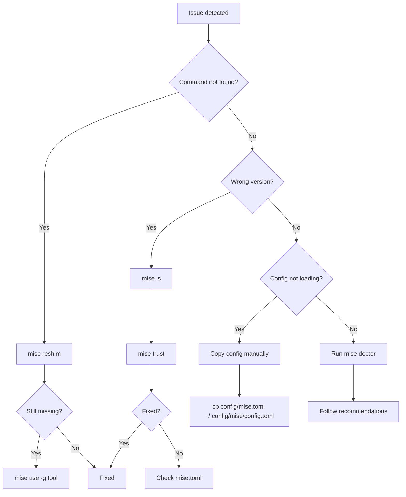

# AI Agent Workflows

> Step-by-step workflows for AI agents working on this macOS development environment

## Entry Points

- [AGENTS.md](../AGENTS.md) - Project knowledge base
- [llms.txt](../llms.txt) - Documentation index
- [CLAUDE.md](../CLAUDE.md) - AI assistant context

---

## Workflow 1: Add New Tool

### When to Use
Installing a new CLI tool, package, or runtime to the environment.

### Decision Flow



### Steps

1. **Determine tool type and backend**
   ```bash
   # Check if tool is already available
   mise ls-remote <tool> 2>/dev/null && echo "Available via mise"
   
   # Check npm registry
   npm view <package> 2>/dev/null && echo "Available via npm"
   
   # Check PyPI
   pip index versions <package> 2>/dev/null && echo "Available via pip"
   ```

2. **Install via mise**
   ```bash
   # CLI binary
   mise use -g <tool>@latest
   
   # npm package (uses Bun backend)
   mise use -g "npm:<package>@latest"
   
   # Python CLI (uses uv backend)
   mise use -g "pipx:<package>@latest"
   
   # GitHub release binary
   mise use -g "ubi:<owner>/<repo>@latest"
   ```

3. **Add to config/mise.toml**
   ```toml
   [tools]
   # Existing tools...
   <tool> = "latest"  # Or specific version
   ```

4. **Add test**
   ```bash
   # Add to tests/test_tools.bats
   @test "<tool> is installed and working" {
     run <tool> --version
     [ "$status" -eq 0 ]
   }
   ```

5. **Verify**
   ```bash
   mise doctor
   bats tests/test_tools.bats
   ```

### Quality Checklist
- [ ] Tool installed via mise (not brew/npm -g/pip)
- [ ] Added to config/mise.toml
- [ ] BATS test added
- [ ] Tests pass
- [ ] mise doctor shows no issues

### Anti-Patterns
| Wrong | Why | Right |
|-------|-----|-------|
| `npm install -g pkg` | Bypasses mise | `mise use -g "npm:pkg"` |
| `pip install pkg` | System pollution | `mise use -g "pipx:pkg"` |
| `brew install cli` | Not managed by mise | `mise use -g cli` |
| `curl \| sh` | Shadow installs | `mise use -g "ubi:repo"` |

---

## Workflow 2: Create Mise Task

### When to Use
Adding a new automation command to the environment.

### Task Structure



### Steps

1. **Choose task location**
   ```bash
   # Tasks defined in config/mise.toml
   cat config/mise.toml | grep -A5 "\[tasks\]"
   ```

2. **Define the task**
   ```toml
   # Simple command
   [tasks.mytask]
   run = "echo 'Hello'"
   description = "Brief description"
   
   # With dependencies
   [tasks.mytask]
   depends = ["validate"]
   run = "my-command"
   
   # With arguments
   [tasks.greet]
   run = "echo Hello $@"
   # Usage: mise run greet -- World
   
   # Script file
   [tasks.complex]
   run = "bash config/scripts/complex.sh"
   ```

3. **Add documentation**
   ```bash
   # Update AGENTS.md navigation map
   # Update MANUAL.md if user-facing
   ```

4. **Test the task**
   ```bash
   mise run mytask
   mise tasks | grep mytask
   ```

### Quality Checklist
- [ ] Task has description
- [ ] Dependencies declared if needed
- [ ] Arguments handled correctly
- [ ] Documented in MANUAL.md (if user-facing)

---

## Workflow 3: Add BATS Test

### When to Use
Adding test coverage for a new feature or validating existing functionality.

### Test Structure



### Steps

1. **Choose test file**
   ```bash
   # Existing test files
   ls tests/test_*.bats
   
   # test_mise.bats     - Mise installation, backends
   # test_tools.bats    - CLI tool availability
   # test_chezmoi.bats  - Dotfile templates
   # test_starship.bats - Prompt configuration
   # test_integration.bats - E2E project structure
   ```

2. **Write the test**
   ```bash
   #!/usr/bin/env bats
   # test_<feature>.bats
   
   setup() {
     # Skip if dependency missing
     if ! command -v required_tool &> /dev/null; then
       skip "required_tool not installed"
     fi
   }
   
   @test "descriptive test name in present tense" {
     run some_command --flag
     [ "$status" -eq 0 ]
     [[ "$output" =~ "expected pattern" ]]
   }
   
   @test "file exists and has content" {
     [ -f "path/to/file" ]
     [ -s "path/to/file" ]  # Non-empty
   }
   ```

3. **Run the test**
   ```bash
   # Single file
   bats tests/test_<feature>.bats
   
   # All tests
   bats tests/
   
   # Verbose output
   bats --verbose-run tests/test_<feature>.bats
   ```

### BATS Assertions Reference

| Assertion | Usage |
|-----------|-------|
| Exit code | `[ "$status" -eq 0 ]` |
| Output contains | `[[ "$output" =~ "pattern" ]]` |
| Output equals | `[ "$output" = "exact" ]` |
| File exists | `[ -f "path" ]` |
| Dir exists | `[ -d "path" ]` |
| Executable | `[ -x "path" ]` |
| Non-empty file | `[ -s "path" ]` |
| String not empty | `[ -n "$var" ]` |

### Quality Checklist
- [ ] Test name is descriptive (present tense)
- [ ] Skip conditions for optional dependencies
- [ ] Both status and output checked
- [ ] Test passes in CI environment

---

## Workflow 4: Configure Dotfiles

### When to Use
Adding or modifying shell configuration, Git settings, or other dotfiles.

### Dotfile Flow



### Steps

1. **Locate template**
   ```bash
   ls config/chezmoi/
   # dot_zshrc.tmpl      → ~/.zshrc
   # dot_gitconfig.tmpl  → ~/.gitconfig
   # .chezmoi.toml.tmpl  → ~/.config/chezmoi/chezmoi.toml
   ```

2. **Edit template**
   ```bash
   # Templates use Go text/template syntax
   # Variables available:
   # {{ .chezmoi.os }}        - Operating system
   # {{ .chezmoi.arch }}      - Architecture
   # {{ .chezmoi.homeDir }}   - Home directory
   # {{ env "VAR" }}          - Environment variable
   ```

3. **Preview changes**
   ```bash
   chezmoi diff
   ```

4. **Apply changes**
   ```bash
   chezmoi apply
   ```

5. **Add test**
   ```bash
   # Add to tests/test_chezmoi.bats
   @test "template generates valid shell config" {
     run chezmoi execute-template < config/chezmoi/dot_zshrc.tmpl
     [ "$status" -eq 0 ]
   }
   ```

### Quality Checklist
- [ ] Template syntax valid
- [ ] chezmoi diff shows expected changes
- [ ] BATS test validates template
- [ ] Shell config loads without errors

---

## Workflow 5: Debug Environment Issues

### When to Use
Troubleshooting tool availability, version conflicts, or configuration problems.

### Debug Decision Tree



### Diagnostic Commands

```bash
# 1. Check mise health
mise doctor

# 2. List installed tools
mise ls

# 3. Check tool path
mise which <tool>
which -a <tool>  # Show all locations

# 4. Verify shims
ls ~/.local/share/mise/shims/

# 5. Check shell activation
echo $MISE_SHELL

# 6. Validate environment
mise run validate

# 7. Check for shadows
mise run validate:tools
```

### Common Issues & Fixes

| Issue | Symptom | Fix |
|-------|---------|-----|
| Shim not found | `command not found` | `mise reshim` |
| Wrong version | `node -v` shows old | `mise trust && mise install` |
| Config not loading | Tasks missing | Copy config to ~/.config/mise/ |
| Tool shadowed | Non-mise path first | Check PATH order |
| Backend missing | npm/pip fails | Ensure bun/uv installed |

### Quality Checklist
- [ ] mise doctor shows green
- [ ] mise run validate passes
- [ ] All BATS tests pass
- [ ] No shadow warnings

---

## Quick Reference

### File Locations

| Purpose | Location |
|---------|----------|
| Tool config | `config/mise.toml` |
| Tasks | `config/mise.toml` [tasks] |
| Scripts | `config/scripts/` |
| Tests | `tests/test_*.bats` |
| Dotfiles | `config/chezmoi/` |
| AI context | `AGENTS.md`, `CLAUDE.md` |

### Validation Commands

```bash
mise doctor          # Mise health
mise run validate    # Environment check
bats tests/          # Run all tests
shellcheck *.sh      # Lint shell scripts
```

### Emergency Recovery

```bash
# Reset mise completely
rm -rf ~/.local/share/mise
curl https://mise.run | sh
eval "$(mise activate zsh)"
mise install
```

---

*Last updated: January 2026*
