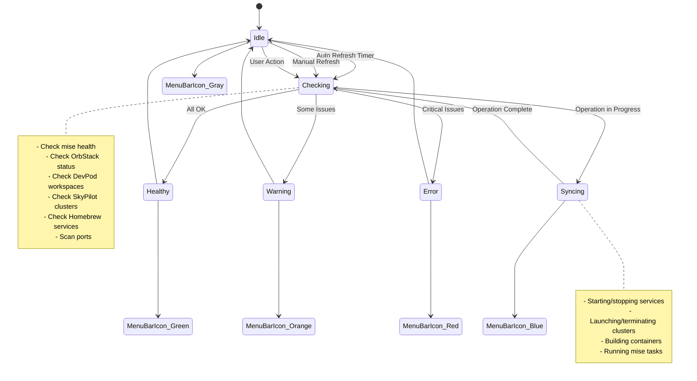

# DevEnvManager - macOS Menu Bar App Wireframes

> Design Specification: February 2026
> Status: Ready for Implementation
> Reference: Similar to [BrewServicesManager](https://github.com/validatedev/BrewServicesManager)

## Overview

A native macOS menu bar app for managing the God-Tier development environment. Provides unified control over:
- **Local Environment** (Mise tools, agent readiness, autofix)
- **Containers** (OrbStack, Docker)
- **DevContainers** (DevPod workspaces)
- **Cloud Agents** (SkyPilot clusters)
- **Services** (Homebrew services with port detection)

## 1. Menu Bar Icon States

```
┌─────────────────────────────────────────────────────────────┐
│ MENU BAR ICON STATES (SF Symbols based)                    │
├─────────────────────────────────────────────────────────────┤
│                                                             │
│  ✅ ALL HEALTHY          ⚠️ WARNING           ❌ ERROR      │
│  ┌───┐                  ┌───┐                ┌───┐         │
│  │ ◆ │ green            │ ◆ │ orange         │ ◆ │ red     │
│  └───┘                  └───┘                └───┘         │
│  All systems OK         1+ warnings          1+ critical   │
│                                                             │
│  🔄 SYNCING             ⏹️ IDLE              🌙 INACTIVE   │
│  ┌───┐                  ┌───┐                ┌───┐         │
│  │ ◇ │ blue (spin)      │ ◇ │ gray           │ ◇ │ dimmed  │
│  └───┘                  └───┘                └───┘         │
│  Operations running     No activity          All stopped   │
│                                                             │
└─────────────────────────────────────────────────────────────┘

Icon Design: Diamond/rhombus shape (◆) with fill color
- Monochrome template image for menu bar
- Adapts to light/dark mode automatically
- Subtle animation on state change
```

## 2. Main Dropdown Menu - Collapsed View

```
┌──────────────────────────────────────────────────────┐
│  DevEnvManager                    ✅ All Systems OK  │
├──────────────────────────────────────────────────────┤
│                                                      │
│  ▼ Local Environment (Mise)              ✅  5/5    │
│     Last check: 2m ago                              │
│                                                      │
│  ▼ Containers (OrbStack)                 ✅  3/4    │
│     OrbStack: Running • 4 containers                │
│                                                      │
│  ▼ DevContainers (DevPod)                ⏹️  0/2    │
│     2 workspaces stopped                            │
│                                                      │
│  ▼ Cloud Agents (SkyPilot)               ⚠️  1/3    │
│     AWS: Connected • 1 cluster UP                   │
│                                                      │
│  ▼ Services (Homebrew)                   ✅  8/10   │
│     8 running • 2 stopped                           │
│                                                      │
├──────────────────────────────────────────────────────┤
│  ⚡ QUICK ACTIONS                                    │
│  [🔄 Update All] [▶️ Start All] [⏹️ Stop All]       │
├──────────────────────────────────────────────────────┤
│  🔄 Refresh All                    ⚙️ Settings      │
│  📊 Dashboard                      ❌ Quit           │
└──────────────────────────────────────────────────────┘

Dimensions: 400px wide, dynamic height
Font: SF Pro Text 13pt (body), SF Pro Display 11pt (meta)
Spacing: 12px padding, 8px between sections
```

## 2.1 Quick Actions Bar - Expanded

```
┌──────────────────────────────────────────────────────────────┐
│  ⚡ QUICK ACTIONS                                            │
├──────────────────────────────────────────────────────────────┤
│                                                              │
│  ┌────────────────────────────────────────────────────────┐ │
│  │ 🌐 GLOBAL OPERATIONS                                   │ │
│  │                                                        │ │
│  │ [🔄 Update Everything]  Updates all tools & services  │ │
│  │ [▶️ Start Everything]   Starts all stopped items      │ │
│  │ [⏹️ Stop Everything]    Stops all running items       │ │
│  │ [🔁 Restart Everything] Restarts all running items    │ │
│  └────────────────────────────────────────────────────────┘ │
│                                                              │
│  ┌────────────────────────────────────────────────────────┐ │
│  │ 📦 BY CATEGORY                                         │ │
│  │                                                        │ │
│  │ LOCAL ENVIRONMENT (Mise)                               │ │
│  │ [🔄 Update Tools] [✅ Validate] [🔧 Autofix]          │ │
│  │                                                        │ │
│  │ CONTAINERS (OrbStack)                                  │ │
│  │ [▶️ Start All] [⏹️ Stop All] [🔁 Restart All] [🗑️ Prune] │ │
│  │                                                        │ │
│  │ DEVCONTAINERS (DevPod)                                 │ │
│  │ [▶️ Start All] [⏹️ Stop All] [🔨 Rebuild All]         │ │
│  │                                                        │ │
│  │ CLOUD AGENTS (SkyPilot)                                │ │
│  │ [▶️ Launch All] [⏹️ Stop All] [💰 Cost Report]        │ │
│  │                                                        │ │
│  │ SERVICES (Homebrew)                                    │ │
│  │ [▶️ Start All] [⏹️ Stop All] [🔁 Restart All]         │ │
│  └────────────────────────────────────────────────────────┘ │
│                                                              │
│  ┌────────────────────────────────────────────────────────┐ │
│  │ ⚙️ PRESETS                                             │ │
│  │                                                        │ │
│  │ [🌅 Morning Startup]    Start dev environment         │ │
│  │    → OrbStack, postgres, redis, DevContainer          │ │
│  │                                                        │ │
│  │ [🌙 End of Day]         Clean shutdown                │ │
│  │    → Stop all containers, cloud agents, services      │ │
│  │                                                        │ │
│  │ [🚀 Full Stack]         Start everything              │ │
│  │    → All services, containers, DevContainers          │ │
│  │                                                        │ │
│  │ [💤 Minimal]            Lightweight mode              │ │
│  │    → Stop non-essential services                      │ │
│  │                                                        │ │
│  │ [+ Create Custom Preset]                              │ │
│  └────────────────────────────────────────────────────────┘ │
│                                                              │
└──────────────────────────────────────────────────────────────┘

Interaction:
- "Update Everything" → Sequential: mise tools → brew services
- "Start Everything" → Parallel start with dependency ordering
- "Stop Everything" → Graceful shutdown in reverse order
- Presets → Saved configurations for common workflows
- Click [+ Create Custom Preset] → Opens preset editor
```

## 2.2 Update Operations Detail

```
┌──────────────────────────────────────────────────────────────┐
│  🔄 UPDATE OPERATIONS                                        │
├──────────────────────────────────────────────────────────────┤
│                                                              │
│  ┌────────────────────────────────────────────────────────┐ │
│  │ MISE TOOLS                                             │ │
│  │                                                        │ │
│  │ ☑ bun          1.1.38 → 1.1.39    [Update]            │ │
│  │ ☐ uv           0.5.11 (latest)    ✓ Up to date        │ │
│  │ ☑ pixi         0.34.0 → 0.35.0    [Update]            │ │
│  │ ☐ python       3.12.8 (latest)    ✓ Up to date        │ │
│  │ ☑ node         22.12.0 → 22.13.0  [Update]            │ │
│  │                                                        │ │
│  │ [Select All] [Deselect All] [Update Selected (3)]     │ │
│  └────────────────────────────────────────────────────────┘ │
│                                                              │
│  ┌────────────────────────────────────────────────────────┐ │
│  │ HOMEBREW PACKAGES                                      │ │
│  │                                                        │ │
│  │ ☑ postgresql@16  16.4 → 16.5      [Update]            │ │
│  │ ☐ redis          7.2.4 (latest)   ✓ Up to date        │ │
│  │ ☑ nginx          1.25.4 → 1.25.5  [Update]            │ │
│  │                                                        │ │
│  │ [Select All] [Deselect All] [Update Selected (2)]     │ │
│  └────────────────────────────────────────────────────────┘ │
│                                                              │
│  ┌────────────────────────────────────────────────────────┐ │
│  │ CONTAINER IMAGES                                       │ │
│  │                                                        │ │
│  │ ☑ postgres:16-alpine   New digest available [Pull]    │ │
│  │ ☐ redis:7-alpine       ✓ Up to date                   │ │
│  │ ☑ nginx:alpine         New digest available [Pull]    │ │
│  │                                                        │ │
│  │ [Select All] [Deselect All] [Pull Selected (2)]       │ │
│  └────────────────────────────────────────────────────────┘ │
│                                                              │
│  ────────────────────────────────────────────────────────   │
│  Summary: 7 updates available                                │
│  [Check for Updates] [Update All Selected (7)]              │
│                                                              │
└──────────────────────────────────────────────────────────────┘

Interaction:
- Checkboxes for selective updates
- [Update] individual items immediately
- [Update All Selected] batch operation
- Shows version diff (current → available)
- Progress indicator during updates
```

## 2.3 Bulk Operation Progress

```
┌──────────────────────────────────────────────────────────────┐
│  🔄 UPDATING...                                              │
├──────────────────────────────────────────────────────────────┤
│                                                              │
│  Overall Progress                                            │
│  ████████████░░░░░░░░░░░░░░░░░░░░░░░░░░░░░░░░░░░░░  4/7     │
│                                                              │
│  ✅ bun          1.1.38 → 1.1.39    Complete               │
│  ✅ pixi         0.34.0 → 0.35.0    Complete               │
│  ✅ node         22.12.0 → 22.13.0  Complete               │
│  🔄 postgresql   16.4 → 16.5        Installing...          │
│     ████████████████░░░░░░░░░░░░░░░░░░░░░░░░░░░░  45%      │
│  ⏳ nginx        1.25.4 → 1.25.5    Pending                │
│  ⏳ postgres:16  Pull image         Pending                │
│  ⏳ nginx:alpine Pull image         Pending                │
│                                                              │
│  [Cancel] [Run in Background]                               │
│                                                              │
└──────────────────────────────────────────────────────────────┘

States:
✅ Complete    - Successfully updated
🔄 In Progress - Currently updating (with progress bar)
⏳ Pending     - Waiting in queue
❌ Failed      - Error occurred (click for details)
⏭️ Skipped     - User cancelled or dependency failed
```

## 3. Local Environment (Mise) - Expanded

```
┌──────────────────────────────────────────────────────────────┐
│  ▼ Local Environment (Mise)                   ✅  5/5       │
├──────────────────────────────────────────────────────────────┤
│                                                              │
│  ┌────────────────────────────────────────────────────────┐ │
│  │ MISE HEALTH                                      ✅     │ │
│  │ Config: ~/.config/mise/config.toml                     │ │
│  │ Version: 2024.12.10                                    │ │
│  │ [Run Doctor] [View Config]                             │ │
│  └────────────────────────────────────────────────────────┘ │
│                                                              │
│  ┌────────────────────────────────────────────────────────┐ │
│  │ TOOLS                                                  │ │
│  │ ✅ bun          1.1.38    [Update] [Shell]            │ │
│  │ ✅ uv           0.5.11    [Update] [Shell]            │ │
│  │ ✅ pixi        0.34.0    [Update] [Shell]            │ │
│  │ ✅ python      3.12.8    [Update] [Shell]            │ │
│  │ ✅ node        22.12.0   [Update] [Shell]            │ │
│  └────────────────────────────────────────────────────────┘ │
│                                                              │
│  ┌────────────────────────────────────────────────────────┐ │
│  │ AGENT READINESS                              ✅        │ │
│  │ All checks passed                                      │ │
│  │ [Run Check] [Fix Issues]                               │ │
│  └────────────────────────────────────────────────────────┘ │
│                                                              │
│  ┌────────────────────────────────────────────────────────┐ │
│  │ AUTOFIX                                      ⚠️  2     │ │
│  │ 2 issues detected                                      │ │
│  │ [View Issues] [Auto Fix]                               │ │
│  └────────────────────────────────────────────────────────┘ │
│                                                              │
│  ┌────────────────────────────────────────────────────────┐ │
│  │ QUICK TASKS                                            │ │
│  │ [Dashboard] [Validate] [Update All] [Help]             │ │
│  └────────────────────────────────────────────────────────┘ │
│                                                              │
└──────────────────────────────────────────────────────────────┘

Interaction:
- Hover on tool row → highlight + show tooltip with full path
- Click tool name → copy version to clipboard
- [Update] → run mise use -g <tool>@latest
- [Shell] → open terminal with tool activated
```

## 4. Containers (OrbStack) - Expanded

```
┌──────────────────────────────────────────────────────────────┐
│  ▼ Containers (OrbStack)                      ✅  3/4       │
├──────────────────────────────────────────────────────────────┤
│                                                              │
│  ┌────────────────────────────────────────────────────────┐ │
│  │ ORBSTACK STATUS                              ✅        │ │
│  │ Running • CPU: 12% • Memory: 2.1 GB                    │ │
│  │ [Open OrbStack] [Restart]                              │ │
│  └────────────────────────────────────────────────────────┘ │
│                                                              │
│  ┌────────────────────────────────────────────────────────┐ │
│  │ CONTAINERS                                             │ │
│  │                                                        │ │
│  │ ✅ postgres-dev                                        │ │
│  │    postgres:16-alpine • Up 2 days                     │ │
│  │    🔌 5432:5432                                        │ │
│  │    [Stop] [Restart] [Logs] [Shell]                    │ │
│  │                                                        │ │
│  │ ✅ redis-cache                                         │ │
│  │    redis:7-alpine • Up 2 days                         │ │
│  │    🔌 6379:6379                                        │ │
│  │    [Stop] [Restart] [Logs] [Shell]                    │ │
│  │                                                        │ │
│  │ ✅ nginx-proxy                                         │ │
│  │    nginx:alpine • Up 5 hours                          │ │
│  │    🔌 80:80, 443:443                                   │ │
│  │    🌐 http://localhost                                 │ │
│  │    [Stop] [Restart] [Logs] [Shell]                    │ │
│  │                                                        │ │
│  │ ⏹️ mongodb-test                                        │ │
│  │    mongo:7 • Exited (0) 3 hours ago                   │ │
│  │    [Start] [Remove] [Logs]                            │ │
│  │                                                        │ │
│  └────────────────────────────────────────────────────────┘ │
│                                                              │
│  [Start All] [Stop All] [Prune]                             │
│                                                              │
└──────────────────────────────────────────────────────────────┘

Interaction:
- Click container name → expand details (env vars, volumes, networks)
- Click port → copy to clipboard
- Click URL → open in browser
- Hover [Logs] → show last 5 lines in tooltip
```

## 5. DevContainers (DevPod) - Expanded

```
┌──────────────────────────────────────────────────────────────┐
│  ▼ DevContainers (DevPod)                     ⏹️  0/2       │
├──────────────────────────────────────────────────────────────┤
│                                                              │
│  ┌────────────────────────────────────────────────────────┐ │
│  │ WORKSPACES                                             │ │
│  │                                                        │ │
│  │ ⏹️ gemini-ai-env                                       │ │
│  │    /Users/ray/dev/github/ray-manaloto/gemini-ai...    │ │
│  │    Provider: Docker • IDE: VSCode                     │ │
│  │    Last used: 3 hours ago                             │ │
│  │    [Start] [Delete] [Rebuild]                         │ │
│  │                                                        │ │
│  │ ⏹️ claude-flow-v3                                      │ │
│  │    /Users/ray/dev/github/ray-manaloto/claude-flow     │ │
│  │    Provider: Docker • IDE: Cursor                     │ │
│  │    Last used: 1 day ago                               │ │
│  │    [Start] [Delete] [Rebuild]                         │ │
│  │                                                        │ │
│  └────────────────────────────────────────────────────────┘ │
│                                                              │
│  [Create Workspace] [Open DevPod]                           │
│                                                              │
└──────────────────────────────────────────────────────────────┘

Running Workspace State:
┌──────────────────────────────────────────────────────────────┐
│  ✅ gemini-ai-env                                            │
│     /Users/ray/dev/github/ray-manaloto/gemini-ai...         │
│     Provider: Docker • IDE: VSCode                          │
│     Running • CPU: 8% • Memory: 512 MB                      │
│     🔌 Ports: 3000→3000, 5432→5432                          │
│     [Stop] [SSH] [Open IDE] [Logs]                          │
└──────────────────────────────────────────────────────────────┘
```

## 6. Cloud Agents (SkyPilot) - Expanded

```
┌──────────────────────────────────────────────────────────────┐
│  ▼ Cloud Agents (SkyPilot)                    ⚠️  1/3       │
├──────────────────────────────────────────────────────────────┤
│                                                              │
│  ┌────────────────────────────────────────────────────────┐ │
│  │ AWS CREDENTIALS                              ✅        │ │
│  │ Profile: default • Region: us-west-2                   │ │
│  │ [Refresh] [Configure]                                  │ │
│  └────────────────────────────────────────────────────────┘ │
│                                                              │
│  ┌────────────────────────────────────────────────────────┐ │
│  │ CLUSTERS                                               │ │
│  │                                                        │ │
│  │ ✅ omo-dev-agent                                       │ │
│  │    g4dn.xlarge • us-west-2a                           │ │
│  │    Up 4 hours • Cost: ~$0.52/hr                       │ │
│  │    🔌 SSH: ubuntu@54.123.45.67                         │ │
│  │    [Stop] [SSH] [Logs] [Exec]                         │ │
│  │                                                        │ │
│  │ ⏹️ training-cluster                                    │ │
│  │    p3.2xlarge • us-west-2b                            │ │
│  │    Stopped 2 days ago                                 │ │
│  │    [Start] [Delete]                                   │ │
│  │                                                        │ │
│  │ ⚠️ inference-node                                      │ │
│  │    g5.xlarge • us-east-1a                             │ │
│  │    Init failed • Last attempt: 1 hour ago             │ │
│  │    Error: Spot instance interrupted                   │ │
│  │    [Retry] [Delete] [View Logs]                       │ │
│  │                                                        │ │
│  └────────────────────────────────────────────────────────┘ │
│                                                              │
│  [Launch New] [Stop All] [Cost Dashboard]                   │
│                                                              │
└──────────────────────────────────────────────────────────────┘

Interaction:
- Click cluster name → show full details (instance type, disk, setup)
- Click SSH address → copy to clipboard
- [SSH] → open terminal with ssh command
- [Exec] → show command palette for common tasks
- Hover cost → show breakdown (compute + storage + network)
```

## 7. Services (Homebrew) - Expanded

```
┌──────────────────────────────────────────────────────────────┐
│  ▼ Services (Homebrew)                        ✅  8/10      │
├──────────────────────────────────────────────────────────────┤
│                                                              │
│  ┌────────────────────────────────────────────────────────┐ │
│  │ RUNNING (8)                                            │ │
│  │                                                        │ │
│  │ ✅ postgresql@16                                       │ │
│  │    🔌 5432 • 🌐 postgresql://localhost:5432            │ │
│  │    PID: 1234 • Up 2 days                              │ │
│  │    [Stop] [Restart] [Logs] [Connect]                  │ │
│  │                                                        │ │
│  │ ✅ redis                                               │ │
│  │    🔌 6379 • 🌐 redis://localhost:6379                 │ │
│  │    PID: 1235 • Up 2 days                              │ │
│  │    [Stop] [Restart] [Logs] [CLI]                      │ │
│  │                                                        │ │
│  │ ✅ nginx                                               │ │
│  │    🔌 80, 443 • 🌐 http://localhost                    │ │
│  │    PID: 1236 • Up 5 hours                             │ │
│  │    [Stop] [Restart] [Logs] [Open]                     │ │
│  │                                                        │ │
│  │ ✅ mysql@8.0                                           │ │
│  │    🔌 3306 • 🌐 mysql://localhost:3306                 │ │
│  │    PID: 1237 • Up 1 day                               │ │
│  │    [Stop] [Restart] [Logs] [Connect]                  │ │
│  │                                                        │ │
│  │ ✅ elasticsearch                                       │ │
│  │    🔌 9200, 9300 • 🌐 http://localhost:9200            │ │
│  │    PID: 1238 • Up 3 hours                             │ │
│  │    [Stop] [Restart] [Logs] [Open]                     │ │
│  │                                                        │ │
│  │ ✅ rabbitmq                                            │ │
│  │    🔌 5672, 15672 • 🌐 http://localhost:15672          │ │
│  │    PID: 1239 • Up 1 day                               │ │
│  │    [Stop] [Restart] [Logs] [Admin]                    │ │
│  │                                                        │ │
│  │ ✅ memcached                                           │ │
│  │    🔌 11211                                            │ │
│  │    PID: 1240 • Up 2 days                              │ │
│  │    [Stop] [Restart] [Logs]                            │ │
│  │                                                        │ │
│  │ ✅ dnsmasq                                             │ │
│  │    🔌 53                                               │ │
│  │    PID: 1241 • Up 5 days                              │ │
│  │    [Stop] [Restart] [Logs]                            │ │
│  │                                                        │ │
│  └────────────────────────────────────────────────────────┘ │
│                                                              │
│  ┌────────────────────────────────────────────────────────┐ │
│  │ STOPPED (2)                                            │ │
│  │                                                        │ │
│  │ ⏹️ mongodb-community                                   │ │
│  │    Stopped 3 hours ago                                │ │
│  │    [Start] [Remove]                                   │ │
│  │                                                        │ │
│  │ ⏹️ httpd                                               │ │
│  │    Stopped 1 day ago                                  │ │
│  │    [Start] [Remove]                                   │ │
│  │                                                        │ │
│  └────────────────────────────────────────────────────────┘ │
│                                                              │
│  [Start All] [Stop All] [Refresh]                           │
│                                                              │
└──────────────────────────────────────────────────────────────┘

Interaction:
- Click service name → show full details (config path, log path)
- Click port → copy to clipboard
- Click URL → open in browser
- [Connect]/[CLI]/[Admin] → open terminal with connection command
- Hover service → show resource usage (CPU, memory)
```

## 8. Action Popover - Detailed View

```
┌──────────────────────────────────────────────────────────────┐
│  Service Details: postgresql@16                              │
├──────────────────────────────────────────────────────────────┤
│                                                              │
│  STATUS                                          ✅ Running │
│  PID                                             1234       │
│  Uptime                                          2d 4h 23m  │
│  CPU                                             2.3%       │
│  Memory                                          156 MB     │
│                                                              │
│  NETWORK                                                     │
│  Port                                            5432       │
│  Connections                                     🔌 12/100  │
│  URL                                             postgresql://localhost:5432
│                                                              │
│  PATHS                                                       │
│  Config                                          /opt/homebrew/etc/postgresql@16/
│  Data                                            /opt/homebrew/var/postgresql@16/
│  Logs                                            /opt/homebrew/var/log/postgresql@16.log
│                                                              │
│  ACTIONS                                                     │
│  [Stop Service]  [Restart Service]  [View Logs]             │
│  [Open Config]   [Open Data Dir]    [Connect]               │
│                                                              │
│  CLI COMMANDS (click to copy)                                │
│  ┌────────────────────────────────────────────────────────┐ │
│  │ $ brew services stop postgresql@16           [📋 Copy] │ │
│  │ $ brew services restart postgresql@16        [📋 Copy] │ │
│  │ $ tail -f /opt/homebrew/var/log/postgresql@16.log  [📋]│ │
│  │ $ psql -h localhost -p 5432 -U postgres      [📋 Copy] │ │
│  └────────────────────────────────────────────────────────┘ │
│                                                              │
│  CUSTOM LINKS                                                │
│  🌐 pgAdmin       http://localhost:5050                      │
│  🌐 Adminer       http://localhost:8080                      │
│                                                              │
│  [Add Custom Link]                              [Close]     │
│                                                              │
└──────────────────────────────────────────────────────────────┘

Dimensions: 500px wide, dynamic height
Appears as overlay/popover from main menu
```

## 8.1 CLI Command Copy Feature

```
┌──────────────────────────────────────────────────────────────┐
│  CLI COMMAND INTERACTIONS                                    │
├──────────────────────────────────────────────────────────────┤
│                                                              │
│  THREE WAYS TO ACCESS CLI COMMANDS:                          │
│                                                              │
│  1. OPTION+CLICK on any action button                        │
│     ┌─────────────────────────────────────────────────────┐ │
│     │  [⏹️ Stop]  ← Normal click = Execute                │ │
│     │  [⏹️ Stop]  ← Option+Click = Copy command           │ │
│     │                                                      │ │
│     │  Toast notification:                                 │ │
│     │  ┌────────────────────────────────────────────────┐ │ │
│     │  │ 📋 Copied to clipboard:                        │ │ │
│     │  │ brew services stop postgresql@16               │ │ │
│     │  └────────────────────────────────────────────────┘ │ │
│     └─────────────────────────────────────────────────────┘ │
│                                                              │
│  2. RIGHT-CLICK context menu on any action                   │
│     ┌─────────────────────────────────────────────────────┐ │
│     │  [⏹️ Stop] → Right-click                            │ │
│     │  ┌────────────────────────┐                         │ │
│     │  │ ▶️ Execute             │                         │ │
│     │  │ 📋 Copy Command        │                         │ │
│     │  │ 📄 Copy as Script      │                         │ │
│     │  │ 🖥️ Open in Terminal    │                         │ │
│     │  └────────────────────────┘                         │ │
│     └─────────────────────────────────────────────────────┘ │
│                                                              │
│  3. COMMAND PALETTE (⌘K)                                     │
│     ┌─────────────────────────────────────────────────────┐ │
│     │  🔍 Search commands...                    ⌘K        │ │
│     │  ──────────────────────────────────────────────────│ │
│     │  RECENT                                             │ │
│     │  ▶️ brew services stop postgresql@16      [📋] [▶️]│ │
│     │  ▶️ mise use -g bun@latest               [📋] [▶️]│ │
│     │  ▶️ sky down omo-dev-agent               [📋] [▶️]│ │
│     │  ──────────────────────────────────────────────────│ │
│     │  ALL COMMANDS                                       │ │
│     │  📂 Local > mise doctor                  [📋] [▶️]│ │
│     │  📂 Local > mise use -g {tool}@latest    [📋] [▶️]│ │
│     │  📂 Containers > orb stop                [📋] [▶️]│ │
│     │  📂 Services > brew services list        [📋] [▶️]│ │
│     └─────────────────────────────────────────────────────┘ │
│                                                              │
└──────────────────────────────────────────────────────────────┘

Keyboard Shortcuts:
- Click           → Execute action
- Option+Click    → Copy command to clipboard
- Right-Click     → Show context menu
- ⌘K              → Open command palette
- ⌘C (on focused) → Copy command
```

## 8.2 Command Reference Panel

```
┌──────────────────────────────────────────────────────────────┐
│  📖 Command Reference                              [×]       │
├──────────────────────────────────────────────────────────────┤
│                                                              │
│  🔍 Filter commands...                                       │
│                                                              │
│  ┌────────────────────────────────────────────────────────┐ │
│  │ LOCAL ENVIRONMENT (Mise)                               │ │
│  │                                                        │ │
│  │ Health Check                                           │ │
│  │ $ mise doctor                                  [📋]    │ │
│  │                                                        │ │
│  │ Update Tool                                            │ │
│  │ $ mise use -g {tool}@latest                    [📋]    │ │
│  │                                                        │ │
│  │ Update All Tools                                       │ │
│  │ $ mise upgrade                                 [📋]    │ │
│  │                                                        │ │
│  │ List Installed                                         │ │
│  │ $ mise ls                                      [📋]    │ │
│  │                                                        │ │
│  │ Run Task                                               │ │
│  │ $ mise run {task}                              [📋]    │ │
│  └────────────────────────────────────────────────────────┘ │
│                                                              │
│  ┌────────────────────────────────────────────────────────┐ │
│  │ CONTAINERS (OrbStack)                                  │ │
│  │                                                        │ │
│  │ Start OrbStack                                         │ │
│  │ $ orb start                                    [📋]    │ │
│  │                                                        │ │
│  │ Stop OrbStack                                          │ │
│  │ $ orb stop                                     [📋]    │ │
│  │                                                        │ │
│  │ List Containers                                        │ │
│  │ $ docker ps -a                                 [📋]    │ │
│  │                                                        │ │
│  │ Start Container                                        │ │
│  │ $ docker start {container}                     [📋]    │ │
│  │                                                        │ │
│  │ Stop Container                                         │ │
│  │ $ docker stop {container}                      [📋]    │ │
│  │                                                        │ │
│  │ View Logs                                              │ │
│  │ $ docker logs -f {container}                   [📋]    │ │
│  │                                                        │ │
│  │ Shell into Container                                   │ │
│  │ $ docker exec -it {container} /bin/sh          [📋]    │ │
│  └────────────────────────────────────────────────────────┘ │
│                                                              │
│  ┌────────────────────────────────────────────────────────┐ │
│  │ DEVCONTAINERS (DevPod)                                 │ │
│  │                                                        │ │
│  │ List Workspaces                                        │ │
│  │ $ devpod list                                  [📋]    │ │
│  │                                                        │ │
│  │ Start Workspace                                        │ │
│  │ $ devpod up {workspace}                        [📋]    │ │
│  │                                                        │ │
│  │ Stop Workspace                                         │ │
│  │ $ devpod stop {workspace}                      [📋]    │ │
│  │                                                        │ │
│  │ SSH to Workspace                                       │ │
│  │ $ devpod ssh {workspace}                       [📋]    │ │
│  │                                                        │ │
│  │ Delete Workspace                                       │ │
│  │ $ devpod delete {workspace}                    [📋]    │ │
│  └────────────────────────────────────────────────────────┘ │
│                                                              │
│  ┌────────────────────────────────────────────────────────┐ │
│  │ CLOUD AGENTS (SkyPilot)                                │ │
│  │                                                        │ │
│  │ Check Status                                           │ │
│  │ $ sky status                                   [📋]    │ │
│  │                                                        │ │
│  │ Launch Cluster                                         │ │
│  │ $ sky launch {yaml} -c {name}                  [📋]    │ │
│  │                                                        │ │
│  │ Stop Cluster                                           │ │
│  │ $ sky stop {cluster}                           [📋]    │ │
│  │                                                        │ │
│  │ Terminate Cluster                                      │ │
│  │ $ sky down {cluster} -y                        [📋]    │ │
│  │                                                        │ │
│  │ SSH to Cluster                                         │ │
│  │ $ ssh {cluster}                                [📋]    │ │
│  │                                                        │ │
│  │ View Logs                                              │ │
│  │ $ sky logs {cluster}                           [📋]    │ │
│  └────────────────────────────────────────────────────────┘ │
│                                                              │
│  ┌────────────────────────────────────────────────────────┐ │
│  │ SERVICES (Homebrew)                                    │ │
│  │                                                        │ │
│  │ List Services                                          │ │
│  │ $ brew services list                           [📋]    │ │
│  │                                                        │ │
│  │ Start Service                                          │ │
│  │ $ brew services start {service}                [📋]    │ │
│  │                                                        │ │
│  │ Stop Service                                           │ │
│  │ $ brew services stop {service}                 [📋]    │ │
│  │                                                        │ │
│  │ Restart Service                                        │ │
│  │ $ brew services restart {service}              [📋]    │ │
│  │                                                        │ │
│  │ Service Info                                           │ │
│  │ $ brew services info {service}                 [📋]    │ │
│  └────────────────────────────────────────────────────────┘ │
│                                                              │
│  [Export All Commands]  [Copy Selected]  [Close]            │
│                                                              │
└──────────────────────────────────────────────────────────────┘

Accessible via: Menu Bar → Help → Command Reference (⌘?)
```

## 8.3 Action Button with Command Preview

```
┌──────────────────────────────────────────────────────────────┐
│  HOVER STATE - Action Button with Command Preview            │
├──────────────────────────────────────────────────────────────┤
│                                                              │
│  Normal state:                                               │
│  ┌──────────────────────────┐                               │
│  │  [⏹️ Stop]               │                               │
│  └──────────────────────────┘                               │
│                                                              │
│  Hover state (after 0.5s delay):                            │
│  ┌──────────────────────────┐                               │
│  │  [⏹️ Stop]               │                               │
│  └──────────────────────────┘                               │
│           │                                                  │
│           ▼                                                  │
│  ┌────────────────────────────────────────────────────────┐ │
│  │  brew services stop postgresql@16                      │ │
│  │                                           [📋 Copy]    │ │
│  │  ─────────────────────────────────────────────────────│ │
│  │  Click to execute • Option+Click to copy              │ │
│  └────────────────────────────────────────────────────────┘ │
│                                                              │
│  Settings option to enable/disable command preview tooltip   │
│                                                              │
└──────────────────────────────────────────────────────────────┘
```

## 8.4 Export Commands as Script

```
┌──────────────────────────────────────────────────────────────┐
│  📄 Export as Script                                   [×]   │
├──────────────────────────────────────────────────────────────┤
│                                                              │
│  Export Format:  [Shell Script ▼]                            │
│                  ├─ Shell Script (.sh)                       │
│                  ├─ Fish Script (.fish)                      │
│                  ├─ PowerShell (.ps1)                        │
│                  ├─ Makefile                                 │
│                  └─ mise.toml tasks                          │
│                                                              │
│  ┌────────────────────────────────────────────────────────┐ │
│  │  #!/bin/bash                                           │ │
│  │  # DevEnvManager - Exported Commands                   │ │
│  │  # Generated: 2026-02-04 01:30:00                      │ │
│  │                                                        │ │
│  │  # Start development environment                       │ │
│  │  start_dev() {                                         │ │
│  │      echo "Starting OrbStack..."                       │ │
│  │      orb start                                         │ │
│  │                                                        │ │
│  │      echo "Starting services..."                       │ │
│  │      brew services start postgresql@16                 │ │
│  │      brew services start redis                         │ │
│  │      brew services start nginx                         │ │
│  │                                                        │ │
│  │      echo "Starting DevContainer..."                   │ │
│  │      devpod up gemini-ai-env                          │ │
│  │  }                                                     │ │
│  │                                                        │ │
│  │  # Stop development environment                        │ │
│  │  stop_dev() {                                          │ │
│  │      echo "Stopping DevContainer..."                   │ │
│  │      devpod stop gemini-ai-env                        │ │
│  │                                                        │ │
│  │      echo "Stopping services..."                       │ │
│  │      brew services stop postgresql@16                  │ │
│  │      brew services stop redis                          │ │
│  │      brew services stop nginx                          │ │
│  │                                                        │ │
│  │      echo "Stopping OrbStack..."                       │ │
│  │      orb stop                                          │ │
│  │  }                                                     │ │
│  │                                                        │ │
│  │  # Parse arguments                                     │ │
│  │  case "$1" in                                          │ │
│  │      start) start_dev ;;                               │ │
│  │      stop) stop_dev ;;                                 │ │
│  │      *) echo "Usage: $0 {start|stop}" ;;              │ │
│  │  esac                                                  │ │
│  └────────────────────────────────────────────────────────┘ │
│                                                              │
│  [📋 Copy to Clipboard]  [💾 Save to File]  [Cancel]        │
│                                                              │
└──────────────────────────────────────────────────────────────┘

Export options:
- Current preset commands
- All commands for a category
- Selected commands from command palette
- Full environment setup script
```

## 9. Settings Panel

```
┌──────────────────────────────────────────────────────────────┐
│  Settings                                                    │
├──────────────────────────────────────────────────────────────┤
│                                                              │
│  GENERAL                                                     │
│  ☑ Launch at login                                          │
│  ☑ Show in Dock                                             │
│  ☐ Show notifications                                       │
│  ☑ Check for updates automatically                          │
│                                                              │
│  REFRESH INTERVALS                                           │
│  Local Environment    [  30 sec  ▼]                         │
│  Containers           [  10 sec  ▼]                         │
│  DevContainers        [  30 sec  ▼]                         │
│  Cloud Agents         [  60 sec  ▼]                         │
│  Services             [  15 sec  ▼]                         │
│                                                              │
│  APPEARANCE                                                  │
│  Theme                [ System   ▼]  (System/Light/Dark)    │
│  Menu bar icon        [ Colored  ▼]  (Colored/Monochrome)   │
│  Density              [ Compact  ▼]  (Compact/Comfortable)  │
│                                                              │
│  ADVANCED                                                    │
│  ☑ Debug mode                                               │
│  ☐ Show hidden services                                     │
│  ☑ Enable experimental features                             │
│                                                              │
│  PATHS                                                       │
│  Mise config          ~/.config/mise/config.toml            │
│  [Change]                                                    │
│                                                              │
│  DevPod config        ~/.devpod/config.yaml                 │
│  [Change]                                                    │
│                                                              │
│  SkyPilot config      ~/.sky/config.yaml                    │
│  [Change]                                                    │
│                                                              │
│  DANGER ZONE                                                 │
│  [Reset All Settings]  [Clear Cache]  [Uninstall]           │
│                                                              │
│  ────────────────────────────────────────────────────────   │
│  DevEnvManager v1.0.0                                        │
│  [Check for Updates]  [View Logs]  [Report Issue]           │
│                                                              │
│  [Cancel]                                      [Save]        │
│                                                              │
└──────────────────────────────────────────────────────────────┘

Dimensions: 600px wide × 700px tall
Modal window, not popover
```

## 10. Quick Actions Bar (Hover State)

```
┌──────────────────────────────────────────────────────────────┐
│  ✅ postgresql@16                                            │
│     🔌 5432 • 🌐 postgresql://localhost:5432                 │
│     PID: 1234 • Up 2 days                                   │
│                                                              │
│     ┌────────────────────────────────────────────────────┐  │
│     │ [⏹️ Stop] [🔄 Restart] [📋 Logs] [🔗 Connect]     │  │
│     └────────────────────────────────────────────────────┘  │
│                                                              │
└──────────────────────────────────────────────────────────────┘

Interaction:
- Hover on service row → quick actions appear with slide-in animation
- Actions are icon + text buttons
- Tooltips on hover explain each action
- Click outside → actions fade out
```

## 11. Port Detection Display

```
┌──────────────────────────────────────────────────────────────┐
│  PORT DETECTION                                              │
├──────────────────────────────────────────────────────────────┤
│                                                              │
│  🔌 Port 5432                                                │
│     Service: postgresql@16                                   │
│     Process: postgres (PID 1234)                            │
│     URL: postgresql://localhost:5432                         │
│     [Copy URL] [Test Connection]                            │
│                                                              │
│  🔌 Port 6379                                                │
│     Service: redis                                          │
│     Process: redis-server (PID 1235)                        │
│     URL: redis://localhost:6379                             │
│     [Copy URL] [Test Connection]                            │
│                                                              │
│  🔌 Port 3000                                                │
│     Container: nginx-proxy                                  │
│     Process: nginx (PID 1236)                               │
│     URL: http://localhost:3000                              │
│     [Copy URL] [Open Browser]                               │
│                                                              │
│  🔌 Port 8080                                                │
│     DevContainer: gemini-ai-env                             │
│     Process: node (PID 1237)                                │
│     URL: http://localhost:8080                              │
│     [Copy URL] [Open Browser]                               │
│                                                              │
│  ⚠️ Port 80                                                  │
│     Multiple processes detected!                            │
│     - nginx (PID 1236)                                      │
│     - httpd (PID 1238)                                      │
│     [Resolve Conflict]                                      │
│                                                              │
└──────────────────────────────────────────────────────────────┘

Accessible via: [View All Ports] button in main menu
```

## 12. Dashboard View (Separate Window)

```
┌────────────────────────────────────────────────────────────────────────────┐
│  DevEnvManager Dashboard                                    [−] [□] [×]    │
├────────────────────────────────────────────────────────────────────────────┤
│                                                                            │
│  ┌──────────────────────────────────────────────────────────────────────┐ │
│  │  SYSTEM OVERVIEW                                                     │ │
│  │                                                                      │ │
│  │  ┌──────────┐  ┌──────────┐  ┌──────────┐  ┌──────────┐           │ │
│  │  │    ✅    │  │    ✅    │  │    ⏹️    │  │    ⚠️    │           │ │
│  │  │  Local   │  │Container │  │ DevCont  │  │  Cloud   │           │ │
│  │  │   5/5    │  │   3/4    │  │   0/2    │  │   1/3    │           │ │
│  │  └──────────┘  └──────────┘  └──────────┘  └──────────┘           │ │
│  │                                                                      │ │
│  │  ┌──────────┐                                                       │ │
│  │  │    ✅    │                                                       │ │
│  │  │ Services │                                                       │ │
│  │  │   8/10   │                                                       │ │
│  │  └──────────┘                                                       │ │
│  │                                                                      │ │
│  └──────────────────────────────────────────────────────────────────────┘ │
│                                                                            │
│  ┌──────────────────────────────────────────────────────────────────────┐ │
│  │  RESOURCE USAGE                                                      │ │
│  │                                                                      │ │
│  │  CPU Usage                                                           │ │
│  │  ████████░░░░░░░░░░░░░░░░░░░░░░░░░░░░░░░░░░░░░░░░░░░░░░  24%       │ │
│  │                                                                      │ │
│  │  Memory Usage                                                        │ │
│  │  ████████████████░░░░░░░░░░░░░░░░░░░░░░░░░░░░░░░░░░░░░░  42%       │ │
│  │  6.7 GB / 16 GB                                                      │ │
│  │                                                                      │ │
│  │  Disk Usage                                                          │ │
│  │  ████████████████████████████░░░░░░░░░░░░░░░░░░░░░░░░░░  68%       │ │
│  │  340 GB / 500 GB                                                     │ │
│  │                                                                      │ │
│  └──────────────────────────────────────────────────────────────────────┘ │
│                                                                            │
│  ┌──────────────────────────────────────────────────────────────────────┐ │
│  │  RECENT ACTIVITY                                                     │ │
│  │                                                                      │ │
│  │  14:32  ✅  postgresql@16 started                                   │ │
│  │  14:15  🔄  mise tools updated (bun 1.1.37 → 1.1.38)                │ │
│  │  13:45  ⚠️  SkyPilot cluster 'inference-node' failed to start       │ │
│  │  13:30  ✅  DevContainer 'gemini-ai-env' started                    │ │
│  │  12:00  ⏹️  nginx service stopped                                   │ │
│  │  11:45  ✅  OrbStack started                                        │ │
│  │                                                                      │ │
│  │  [View All Logs]                                                     │ │
│  └──────────────────────────────────────────────────────────────────────┘ │
│                                                                            │
│  ┌──────────────────────────────────────────────────────────────────────┐ │
│  │  CLOUD COSTS (Last 7 Days)                                          │ │
│  │                                                                      │ │
│  │  Total: $24.56                                                       │ │
│  │                                                                      │ │
│  │  omo-dev-agent        $12.48  (24h)                                 │ │
│  │  training-cluster     $8.32   (16h)                                 │ │
│  │  inference-node       $3.76   (8h)                                  │ │
│  │                                                                      │ │
│  │  [View Detailed Breakdown]                                           │ │
│  └──────────────────────────────────────────────────────────────────────┘ │
│                                                                            │
└────────────────────────────────────────────────────────────────────────────┘

Dimensions: 1000px wide × 800px tall
Separate window, not menu bar dropdown
```

## 13. Notification Examples

```
┌─────────────────────────────────────────────┐
│  DevEnvManager                              │
├─────────────────────────────────────────────┤
│  ⚠️ Service Failed                          │
│                                             │
│  postgresql@16 stopped unexpectedly         │
│                                             │
│  [Restart] [View Logs] [Dismiss]            │
└─────────────────────────────────────────────┘

┌─────────────────────────────────────────────┐
│  DevEnvManager                              │
├─────────────────────────────────────────────┤
│  ✅ Update Available                        │
│                                             │
│  bun 1.1.38 → 1.1.39                        │
│                                             │
│  [Update Now] [Later] [Dismiss]             │
└─────────────────────────────────────────────┘

┌─────────────────────────────────────────────┐
│  DevEnvManager                              │
├─────────────────────────────────────────────┤
│  💰 Cloud Cost Alert                        │
│                                             │
│  omo-dev-agent running for 8 hours          │
│  Cost: $4.16                                │
│                                             │
│  [Stop Now] [Remind in 1h] [Dismiss]        │
└─────────────────────────────────────────────┘
```

## 14. Mermaid Architecture Diagram

```mermaid
graph TB
    subgraph "Menu Bar App"
        A[Menu Bar Icon] --> B[Main Dropdown Menu]
        B --> C[Local Environment]
        B --> D[Containers]
        B --> E[DevContainers]
        B --> F[Cloud Agents]
        B --> G[Services]
        B --> H[Settings]
        B --> I[Dashboard]
    end
    
    subgraph "Local Environment (Mise)"
        C --> C1[Mise Health]
        C --> C2[Tool Versions]
        C --> C3[Agent Readiness]
        C --> C4[Autofix Status]
        C --> C5[Quick Tasks]
    end
    
    subgraph "Containers (OrbStack)"
        D --> D1[OrbStack Status]
        D --> D2[Container List]
        D2 --> D3[Running Containers]
        D2 --> D4[Stopped Containers]
    end
    
    subgraph "DevContainers (DevPod)"
        E --> E1[Workspace List]
        E1 --> E2[Running Workspaces]
        E1 --> E3[Stopped Workspaces]
    end
    
    subgraph "Cloud Agents (SkyPilot)"
        F --> F1[AWS Credentials]
        F --> F2[Cluster List]
        F2 --> F3[Running Clusters]
        F2 --> F4[Stopped Clusters]
        F2 --> F5[Failed Clusters]
    end
    
    subgraph "Services (Homebrew)"
        G --> G1[Running Services]
        G --> G2[Stopped Services]
        G1 --> G3[Port Detection]
        G1 --> G4[Custom Links]
    end
    
    subgraph "Backend Services"
        J[Mise CLI]
        K[OrbStack API]
        L[DevPod CLI]
        M[SkyPilot CLI]
        N[Homebrew Services]
        O[Port Scanner]
    end
    
    C --> J
    D --> K
    E --> L
    F --> M
    G --> N
    G --> O
    
    style A fill:#4CAF50
    style B fill:#2196F3
    style C fill:#FF9800
    style D fill:#9C27B0
    style E fill:#00BCD4
    style F fill:#F44336
    style G fill:#8BC34A
```



## 15. State Flow Diagram



## 16. Component Hierarchy

```
DevEnvManagerApp
├── MenuBarController
│   ├── StatusItemView (menu bar icon)
│   └── MenuBuilder
│       ├── HeaderView (app name + status)
│       ├── SectionView (collapsible)
│       │   ├── LocalEnvironmentSection
│       │   │   ├── MiseHealthCard
│       │   │   ├── ToolListView
│       │   │   ├── AgentReadinessCard
│       │   │   ├── AutofixCard
│       │   │   └── QuickTasksBar
│       │   ├── ContainersSection
│       │   │   ├── OrbStackStatusCard
│       │   │   └── ContainerListView
│       │   │       └── ContainerRow
│       │   │           ├── StatusIndicator
│       │   │           ├── PortBadge
│       │   │           ├── URLLink
│       │   │           └── ActionButtons
│       │   ├── DevContainersSection
│       │   │   └── WorkspaceListView
│       │   │       └── WorkspaceRow
│       │   ├── CloudAgentsSection
│       │   │   ├── AWSCredentialsCard
│       │   │   └── ClusterListView
│       │   │       └── ClusterRow
│       │   └── ServicesSection
│       │       ├── RunningServicesList
│       │       └── StoppedServicesList
│       │           └── ServiceRow
│       │               ├── StatusIndicator
│       │               ├── PortBadge
│       │               ├── URLLink
│       │               └── QuickActionsBar
│       └── FooterView
│           ├── RefreshButton
│           ├── SettingsButton
│           ├── DashboardButton
│           └── QuitButton
├── SettingsWindow
│   ├── GeneralTab
│   ├── RefreshIntervalsTab
│   ├── AppearanceTab
│   ├── AdvancedTab
│   └── PathsTab
├── DashboardWindow
│   ├── SystemOverviewPanel
│   ├── ResourceUsagePanel
│   ├── RecentActivityPanel
│   └── CloudCostsPanel
├── DetailPopover
│   ├── ServiceDetailsView
│   ├── ContainerDetailsView
│   ├── WorkspaceDetailsView
│   └── ClusterDetailsView
└── BackendServices
    ├── MiseService
    ├── OrbStackService
    ├── DevPodService
    ├── SkyPilotService
    ├── HomebrewService
    ├── PortScannerService
    └── NotificationService
```

## 17. Data Models

```swift
// Status enum
enum Status {
    case running
    case stopped
    case warning
    case error
    case loading
}

// Mise Tool
struct MiseTool {
    let name: String
    let version: String
    let status: Status
    let path: String
    let updateAvailable: Bool
    let latestVersion: String?
}

// Container
struct Container {
    let id: String
    let name: String
    let image: String
    let status: Status
    let uptime: TimeInterval
    let ports: [PortMapping]
    let urls: [URL]
    let cpu: Double
    let memory: Int64
}

// DevPod Workspace
struct Workspace {
    let id: String
    let name: String
    let path: String
    let provider: String
    let ide: String
    let status: Status
    let lastUsed: Date
    let ports: [PortMapping]
}

// SkyPilot Cluster
struct Cluster {
    let name: String
    let instanceType: String
    let region: String
    let status: Status
    let uptime: TimeInterval?
    let costPerHour: Double
    let sshAddress: String?
    let errorMessage: String?
}

// Homebrew Service
struct Service {
    let name: String
    let status: Status
    let pid: Int?
    let uptime: TimeInterval?
    let ports: [Int]
    let urls: [URL]
    let customLinks: [CustomLink]
    let configPath: String
    let logPath: String
    let cpu: Double?
    let memory: Int64?
}

// Port Mapping
struct PortMapping {
    let host: Int
    let container: Int
    let protocol: String
}

// Custom Link
struct CustomLink {
    let name: String
    let url: URL
}
```

## 18. Key Interactions Summary

### Menu Bar Icon
- **Click**: Open/close main menu
- **Right-click**: Quick actions menu (Refresh All, Settings, Quit)
- **Hover**: Show tooltip with overall status

### Section Headers
- **Click**: Expand/collapse section
- **Double-click**: Refresh section only
- **Right-click**: Section-specific actions

### Service/Container/Workspace Rows
- **Click**: Expand details
- **Hover**: Show quick actions bar
- **Double-click**: Default action (open/connect)
- **Right-click**: Context menu

### Buttons
- **[Start]/[Stop]**: Toggle service state
- **[Restart]**: Restart service
- **[Logs]**: Open logs in terminal or viewer
- **[SSH]/[Shell]**: Open terminal with connection
- **[Open]/[Connect]**: Open in browser or client

### Ports & URLs
- **Click port**: Copy to clipboard
- **Click URL**: Open in browser
- **Hover**: Show tooltip with full details

### Status Indicators
- ✅ Green: Running/healthy
- ⏹️ Gray: Stopped
- ⚠️ Orange: Warning
- ❌ Red: Error
- 🔄 Blue: Loading/syncing

---

## 19. Technical Implementation Notes

### Swift/SwiftUI Stack
```swift
// Menu bar app using SwiftUI
@main
struct DevEnvManagerApp: App {
    @NSApplicationDelegateAdaptor(AppDelegate.self) var appDelegate
    
    var body: some Scene {
        Settings {
            SettingsView()
        }
    }
}

class AppDelegate: NSObject, NSApplicationDelegate {
    var statusItem: NSStatusItem?
    var popover: NSPopover?
    
    func applicationDidFinishLaunching(_ notification: Notification) {
        // Create menu bar item
        statusItem = NSStatusBar.system.statusItem(withLength: NSStatusItem.variableLength)
        
        // Setup popover
        popover = NSPopover()
        popover?.contentViewController = NSHostingController(rootView: MainMenuView())
        popover?.behavior = .transient
    }
}
```

### Backend Services
```swift
// Mise service
class MiseService: ObservableObject {
    @Published var health: Status = .loading
    @Published var tools: [MiseTool] = []
    
    func checkHealth() async {
        // Run: mise doctor
    }
    
    func getTools() async {
        // Run: mise ls
    }
    
    func updateTool(_ tool: String) async {
        // Run: mise use -g <tool>@latest
    }
}

// OrbStack service
class OrbStackService: ObservableObject {
    @Published var status: Status = .loading
    @Published var containers: [Container] = []
    
    func getStatus() async {
        // Check OrbStack.app running
    }
    
    func getContainers() async {
        // Run: orb list
    }
    
    func startContainer(_ id: String) async {
        // Run: orb start <id>
    }
}

// Port scanner
class PortScannerService {
    func scanPorts() async -> [Int: ProcessInfo] {
        // Run: lsof -iTCP -sTCP:LISTEN -n -P
    }
}
```

### Auto-refresh
```swift
class RefreshManager: ObservableObject {
    var timers: [String: Timer] = [:]
    
    func startAutoRefresh() {
        // Local environment: 30s
        timers["local"] = Timer.scheduledTimer(withTimeInterval: 30, repeats: true) { _ in
            Task { await miseService.refresh() }
        }
        
        // Containers: 10s
        timers["containers"] = Timer.scheduledTimer(withTimeInterval: 10, repeats: true) { _ in
            Task { await orbStackService.refresh() }
        }
        
        // Services: 15s
        timers["services"] = Timer.scheduledTimer(withTimeInterval: 15, repeats: true) { _ in
            Task { await homebrewService.refresh() }
        }
    }
}
```

### Notifications
```swift
class NotificationManager {
    func sendNotification(title: String, body: String, actions: [String]) {
        let content = UNMutableNotificationContent()
        content.title = title
        content.body = body
        content.sound = .default
        
        // Add actions
        for action in actions {
            content.categoryIdentifier = "SERVICE_ACTION"
        }
        
        let request = UNNotificationRequest(identifier: UUID().uuidString, content: content, trigger: nil)
        UNUserNotificationCenter.current().add(request)
    }
}
```

---

## 20. Visual Design System

### Colors (Adaptive)
```swift
// Light mode
let green = Color(hex: "#10B981")    // Running
let orange = Color(hex: "#F59E0B")   // Warning
let red = Color(hex: "#EF4444")      // Error
let blue = Color(hex: "#3B82F6")     // Loading
let gray = Color(hex: "#6B7280")     // Stopped

// Dark mode
let green = Color(hex: "#34D399")
let orange = Color(hex: "#FBBF24")
let red = Color(hex: "#F87171")
let blue = Color(hex: "#60A5FA")
let gray = Color(hex: "#9CA3AF")
```

### Typography
```swift
// SF Pro Display for headers
let headerFont = Font.system(.title3, design: .default, weight: .semibold)

// SF Pro Text for body
let bodyFont = Font.system(.body, design: .default)

// SF Mono for code/paths
let monoFont = Font.system(.body, design: .monospaced)
```

### Spacing
```swift
let spacing = (
    xs: 4.0,
    sm: 8.0,
    md: 12.0,
    lg: 16.0,
    xl: 24.0
)
```

### Animations
```swift
// Smooth state transitions
let defaultAnimation = Animation.easeInOut(duration: 0.2)

// Loading spinner
let spinAnimation = Animation.linear(duration: 1.0).repeatForever(autoreverses: false)

// Slide-in actions
let slideAnimation = Animation.spring(response: 0.3, dampingFraction: 0.7)
```

---

## 20. Testing Strategy

### 20.1 Test Pyramid

```
                    ┌─────────────┐
                    │   E2E/UI    │  ← XCUITest (10%)
                    │   Tests     │     Slow, flaky, essential
                    ├─────────────┤
                    │ Integration │  ← Swift Testing (20%)
                    │   Tests     │     CLI interactions, state
                    ├─────────────┤
                    │    Unit     │  ← Swift Testing (70%)
                    │   Tests     │     Fast, isolated, comprehensive
                    └─────────────┘
```

### 20.2 Unit Tests (Swift Testing)

```swift
import Testing
@testable import DevEnvManager

// =============================================================================
// Service Status Tests
// =============================================================================

struct ServiceStatusTests {
    
    @Test("Parse Homebrew service JSON correctly")
    func parseHomebrewServiceJSON() async throws {
        let json = """
        [{"name":"postgresql@16","status":"started","user":"ray","file":"/opt/homebrew/..."}]
        """
        let services = try HomebrewServiceParser.parse(json: json)
        
        #expect(services.count == 1)
        #expect(services[0].name == "postgresql@16")
        #expect(services[0].status == .running)
    }
    
    @Test("Handle missing service gracefully")
    func handleMissingService() async throws {
        let store = ServicesStore(client: MockBrewClient())
        await store.refresh()
        
        let service = store.service(named: "nonexistent")
        #expect(service == nil)
    }
    
    @Test("Port detection parses lsof output")
    func portDetectionParsesLsof() async throws {
        let lsofOutput = """
        postgres  1234 ray   5u  IPv4 0x123  0t0  TCP *:5432 (LISTEN)
        postgres  1234 ray   6u  IPv6 0x456  0t0  TCP *:5432 (LISTEN)
        """
        let ports = PortDetector.parse(lsofOutput: lsofOutput)
        
        #expect(ports.count == 1)  // Deduplicated
        #expect(ports.first?.port == 5432)
        #expect(ports.first?.protocol == .tcp)
    }
}

// =============================================================================
// CLI Command Tests
// =============================================================================

struct CLICommandTests {
    
    @Test("Generate correct brew services command")
    func brewServicesCommand() {
        let cmd = CLICommand.brewServices(action: .stop, service: "postgresql@16")
        
        #expect(cmd.executable == "/opt/homebrew/bin/brew")
        #expect(cmd.arguments == ["services", "stop", "postgresql@16"])
        #expect(cmd.displayString == "brew services stop postgresql@16")
    }
    
    @Test("Generate correct mise command")
    func miseCommand() {
        let cmd = CLICommand.mise(action: .upgrade, tool: "bun")
        
        #expect(cmd.displayString == "mise use -g bun@latest")
    }
    
    @Test("Generate correct SkyPilot command")
    func skyPilotCommand() {
        let cmd = CLICommand.sky(action: .down, cluster: "omo-dev-agent")
        
        #expect(cmd.displayString == "sky down omo-dev-agent -y")
    }
    
    @Test("Escape special characters in commands")
    func escapeSpecialCharacters() {
        let cmd = CLICommand.custom("echo 'hello world' && exit")
        
        #expect(cmd.shellEscaped == "echo 'hello world' && exit")
    }
}

// =============================================================================
// State Management Tests
// =============================================================================

struct StateManagementTests {
    
    @Test("Overall status reflects worst component")
    func overallStatusReflectsWorst() async throws {
        let store = AppStateStore()
        store.localStatus = .healthy
        store.containerStatus = .warning
        store.cloudStatus = .error
        
        #expect(store.overallStatus == .error)
    }
    
    @Test("Preset applies correct actions")
    func presetAppliesActions() async throws {
        let preset = Preset.morningStartup
        
        #expect(preset.actions.contains(.startOrbStack))
        #expect(preset.actions.contains(.startService("postgresql@16")))
        #expect(preset.actions.contains(.startService("redis")))
    }
}
```

### 20.3 Integration Tests

```swift
import Testing
@testable import DevEnvManager

// =============================================================================
// CLI Integration Tests (require actual CLI tools)
// =============================================================================

@Suite(.serialized)  // Run sequentially
struct CLIIntegrationTests {
    
    @Test("Mise doctor returns valid JSON")
    func miseDoctorReturnsJSON() async throws {
        let client = MiseClient()
        let result = try await client.doctor()
        
        #expect(result.version != nil)
        #expect(result.configPath != nil)
    }
    
    @Test("Brew services list returns services")
    func brewServicesListReturnsServices() async throws {
        let client = HomebrewClient()
        let services = try await client.listServices()
        
        // At minimum, should return empty array (not throw)
        #expect(services != nil)
    }
    
    @Test("Port scanner detects listening ports")
    func portScannerDetectsPorts() async throws {
        let detector = PortDetector()
        let ports = try await detector.scanAll()
        
        // Should find at least some ports on a dev machine
        #expect(ports.count >= 0)
    }
}

// =============================================================================
// Mock Clients for Isolated Testing
// =============================================================================

actor MockBrewClient: BrewClientProtocol {
    var services: [BrewService] = []
    var shouldFail = false
    
    func listServices() async throws -> [BrewService] {
        if shouldFail { throw MockError.intentionalFailure }
        return services
    }
    
    func start(service: String) async throws {
        if shouldFail { throw MockError.intentionalFailure }
        if let idx = services.firstIndex(where: { $0.name == service }) {
            services[idx].status = .running
        }
    }
    
    func stop(service: String) async throws {
        if shouldFail { throw MockError.intentionalFailure }
        if let idx = services.firstIndex(where: { $0.name == service }) {
            services[idx].status = .stopped
        }
    }
}

enum MockError: Error {
    case intentionalFailure
}
```

### 20.4 XCUITest - UI Automation

```swift
import XCTest

// =============================================================================
// Menu Bar UI Tests
// =============================================================================

final class MenuBarUITests: XCTestCase {
    
    var app: XCUIApplication!
    
    override func setUpWithError() throws {
        continueAfterFailure = false
        app = XCUIApplication()
        app.launchArguments = ["--ui-testing"]
        app.launch()
    }
    
    // -------------------------------------------------------------------------
    // Menu Bar Icon Tests
    // -------------------------------------------------------------------------
    
    func testMenuBarIconExists() throws {
        let menuBarItem = app.menuBars.statusItems["DevEnvManager"]
        XCTAssertTrue(menuBarItem.waitForExistence(timeout: 5))
    }
    
    func testClickMenuBarOpensDropdown() throws {
        let menuBarItem = app.menuBars.statusItems["DevEnvManager"]
        menuBarItem.click()
        
        let menu = app.menus["MainMenu"]
        XCTAssertTrue(menu.waitForExistence(timeout: 2))
    }
    
    // -------------------------------------------------------------------------
    // Section Expansion Tests
    // -------------------------------------------------------------------------
    
    func testExpandLocalEnvironmentSection() throws {
        openMainMenu()
        
        let section = app.buttons["LocalEnvironmentSection"]
        section.click()
        
        // Verify expanded content
        XCTAssertTrue(app.staticTexts["MISE HEALTH"].exists)
        XCTAssertTrue(app.staticTexts["TOOLS"].exists)
    }
    
    func testExpandServicesSection() throws {
        openMainMenu()
        
        let section = app.buttons["ServicesSection"]
        section.click()
        
        // Verify service list appears
        XCTAssertTrue(app.staticTexts["RUNNING"].exists)
    }
    
    // -------------------------------------------------------------------------
    // Action Button Tests
    // -------------------------------------------------------------------------
    
    func testServiceStopButtonExists() throws {
        openMainMenu()
        expandSection("ServicesSection")
        
        let stopButton = app.buttons["StopService_postgresql@16"]
        XCTAssertTrue(stopButton.exists)
    }
    
    func testOptionClickCopiesCommand() throws {
        openMainMenu()
        expandSection("ServicesSection")
        
        let stopButton = app.buttons["StopService_postgresql@16"]
        
        // Option+Click to copy command
        stopButton.click(forDuration: 0.1, 
                         thenDragTo: stopButton,
                         withVelocity: .default,
                         thenHoldForDuration: 0.1,
                         withModifierFlags: .option)
        
        // Verify toast notification
        let toast = app.staticTexts["Copied to clipboard"]
        XCTAssertTrue(toast.waitForExistence(timeout: 2))
    }
    
    func testRightClickShowsContextMenu() throws {
        openMainMenu()
        expandSection("ServicesSection")
        
        let serviceRow = app.buttons["ServiceRow_postgresql@16"]
        serviceRow.rightClick()
        
        // Verify context menu
        XCTAssertTrue(app.menuItems["Execute"].exists)
        XCTAssertTrue(app.menuItems["Copy Command"].exists)
        XCTAssertTrue(app.menuItems["Open in Terminal"].exists)
    }
    
    // -------------------------------------------------------------------------
    // Settings Tests
    // -------------------------------------------------------------------------
    
    func testOpenSettingsWindow() throws {
        openMainMenu()
        
        let settingsButton = app.buttons["SettingsButton"]
        settingsButton.click()
        
        let settingsWindow = app.windows["Settings"]
        XCTAssertTrue(settingsWindow.waitForExistence(timeout: 2))
    }
    
    func testToggleLaunchAtLogin() throws {
        openSettingsWindow()
        
        let toggle = app.checkBoxes["LaunchAtLogin"]
        let initialState = toggle.value as? Bool ?? false
        
        toggle.click()
        
        XCTAssertNotEqual(toggle.value as? Bool, initialState)
    }
    
    // -------------------------------------------------------------------------
    // Quick Actions Tests
    // -------------------------------------------------------------------------
    
    func testQuickActionsBarVisible() throws {
        openMainMenu()
        
        XCTAssertTrue(app.buttons["UpdateAll"].exists)
        XCTAssertTrue(app.buttons["StartAll"].exists)
        XCTAssertTrue(app.buttons["StopAll"].exists)
    }
    
    func testUpdateAllShowsProgress() throws {
        openMainMenu()
        
        let updateAll = app.buttons["UpdateAll"]
        updateAll.click()
        
        // Verify progress view appears
        let progressView = app.progressIndicators["BulkOperationProgress"]
        XCTAssertTrue(progressView.waitForExistence(timeout: 2))
    }
    
    // -------------------------------------------------------------------------
    // Command Palette Tests
    // -------------------------------------------------------------------------
    
    func testCommandPaletteOpensWithShortcut() throws {
        openMainMenu()
        
        // ⌘K to open command palette
        app.typeKey("k", modifierFlags: .command)
        
        let palette = app.windows["CommandPalette"]
        XCTAssertTrue(palette.waitForExistence(timeout: 2))
    }
    
    func testCommandPaletteSearchFilters() throws {
        openCommandPalette()
        
        let searchField = app.searchFields["CommandSearch"]
        searchField.typeText("postgres")
        
        // Should filter to postgres-related commands
        XCTAssertTrue(app.staticTexts["brew services stop postgresql@16"].exists)
        XCTAssertFalse(app.staticTexts["brew services stop redis"].exists)
    }
    
    // -------------------------------------------------------------------------
    // Helper Methods
    // -------------------------------------------------------------------------
    
    private func openMainMenu() {
        let menuBarItem = app.menuBars.statusItems["DevEnvManager"]
        menuBarItem.click()
        _ = app.menus["MainMenu"].waitForExistence(timeout: 2)
    }
    
    private func expandSection(_ identifier: String) {
        let section = app.buttons[identifier]
        if section.exists {
            section.click()
        }
    }
    
    private func openSettingsWindow() {
        openMainMenu()
        app.buttons["SettingsButton"].click()
        _ = app.windows["Settings"].waitForExistence(timeout: 2)
    }
    
    private func openCommandPalette() {
        openMainMenu()
        app.typeKey("k", modifierFlags: .command)
        _ = app.windows["CommandPalette"].waitForExistence(timeout: 2)
    }
}
```

### 20.5 Accessibility Identifiers

```swift
// =============================================================================
// Accessibility Identifiers for UI Testing
// =============================================================================

enum AccessibilityID {
    // Menu Bar
    static let menuBarItem = "DevEnvManager"
    static let mainMenu = "MainMenu"
    
    // Sections
    static let localEnvironmentSection = "LocalEnvironmentSection"
    static let containersSection = "ContainersSection"
    static let devContainersSection = "DevContainersSection"
    static let cloudAgentsSection = "CloudAgentsSection"
    static let servicesSection = "ServicesSection"
    
    // Quick Actions
    static let updateAll = "UpdateAll"
    static let startAll = "StartAll"
    static let stopAll = "StopAll"
    static let restartAll = "RestartAll"
    
    // Service Actions (parameterized)
    static func serviceRow(_ name: String) -> String { "ServiceRow_\(name)" }
    static func startService(_ name: String) -> String { "StartService_\(name)" }
    static func stopService(_ name: String) -> String { "StopService_\(name)" }
    static func restartService(_ name: String) -> String { "RestartService_\(name)" }
    
    // Windows
    static let settingsWindow = "Settings"
    static let dashboardWindow = "Dashboard"
    static let commandPalette = "CommandPalette"
    
    // Settings
    static let launchAtLogin = "LaunchAtLogin"
    static let debugMode = "DebugMode"
    static let refreshInterval = "RefreshInterval"
}

// Usage in SwiftUI:
struct ServiceRow: View {
    let service: BrewService
    
    var body: some View {
        HStack {
            Text(service.name)
            Spacer()
            Button("Stop") { /* ... */ }
                .accessibilityIdentifier(AccessibilityID.stopService(service.name))
        }
        .accessibilityIdentifier(AccessibilityID.serviceRow(service.name))
    }
}
```

### 20.6 Snapshot Testing

```swift
import XCTest
import SnapshotTesting
@testable import DevEnvManager

// =============================================================================
// Visual Regression Tests
// =============================================================================

final class SnapshotTests: XCTestCase {
    
    func testMainMenuAppearance_Light() {
        let view = MainMenuView(store: MockStore.healthy)
            .environment(\.colorScheme, .light)
            .frame(width: 400)
        
        assertSnapshot(of: view, as: .image)
    }
    
    func testMainMenuAppearance_Dark() {
        let view = MainMenuView(store: MockStore.healthy)
            .environment(\.colorScheme, .dark)
            .frame(width: 400)
        
        assertSnapshot(of: view, as: .image)
    }
    
    func testServiceRow_Running() {
        let service = BrewService(name: "postgresql@16", status: .running, pid: 1234)
        let view = ServiceRowView(service: service)
            .frame(width: 350)
        
        assertSnapshot(of: view, as: .image)
    }
    
    func testServiceRow_Stopped() {
        let service = BrewService(name: "postgresql@16", status: .stopped)
        let view = ServiceRowView(service: service)
            .frame(width: 350)
        
        assertSnapshot(of: view, as: .image)
    }
    
    func testServiceRow_Error() {
        let service = BrewService(name: "postgresql@16", status: .error, errorMessage: "Failed to start")
        let view = ServiceRowView(service: service)
            .frame(width: 350)
        
        assertSnapshot(of: view, as: .image)
    }
    
    func testProgressView_Updating() {
        let progress = BulkOperationProgress(total: 7, completed: 3, current: "postgresql")
        let view = BulkOperationProgressView(progress: progress)
            .frame(width: 400)
        
        assertSnapshot(of: view, as: .image)
    }
    
    func testSettingsPanel() {
        let view = SettingsView()
            .frame(width: 600, height: 700)
        
        assertSnapshot(of: view, as: .image)
    }
}

// =============================================================================
// Mock Stores for Snapshots
// =============================================================================

enum MockStore {
    static var healthy: AppStateStore {
        let store = AppStateStore()
        store.localStatus = .healthy
        store.containerStatus = .healthy
        store.devContainerStatus = .stopped
        store.cloudStatus = .healthy
        store.servicesStatus = .healthy
        return store
    }
    
    static var warning: AppStateStore {
        let store = AppStateStore()
        store.localStatus = .healthy
        store.containerStatus = .warning
        store.cloudStatus = .error
        return store
    }
}
```

### 20.7 Test Coverage Requirements

```
┌──────────────────────────────────────────────────────────────┐
│  MINIMUM COVERAGE REQUIREMENTS                               │
├──────────────────────────────────────────────────────────────┤
│                                                              │
│  UNIT TESTS                                    Target: 80%   │
│  ├─ CLI Command Generation                     100%         │
│  ├─ Service Status Parsing                     100%         │
│  ├─ Port Detection                             90%          │
│  ├─ State Management                           85%          │
│  └─ Preset Logic                               80%          │
│                                                              │
│  INTEGRATION TESTS                             Target: 60%   │
│  ├─ Mise CLI Integration                       70%          │
│  ├─ Homebrew CLI Integration                   70%          │
│  ├─ Docker/OrbStack Integration                50%          │
│  ├─ SkyPilot Integration                       50%          │
│  └─ DevPod Integration                         50%          │
│                                                              │
│  UI TESTS                                      Target: 40%   │
│  ├─ Menu Bar Interactions                      60%          │
│  ├─ Section Expansion                          50%          │
│  ├─ Action Buttons                             40%          │
│  ├─ Settings Window                            40%          │
│  └─ Command Palette                            30%          │
│                                                              │
│  SNAPSHOT TESTS                                              │
│  ├─ All major views (light mode)               Required     │
│  ├─ All major views (dark mode)                Required     │
│  └─ Error states                               Required     │
│                                                              │
└──────────────────────────────────────────────────────────────┘
```

### 20.8 CI/CD Integration

```yaml
# .github/workflows/test.yml
name: Test

on:
  push:
    branches: [main]
  pull_request:
    branches: [main]

jobs:
  unit-tests:
    runs-on: macos-14
    steps:
      - uses: actions/checkout@v4
      
      - name: Select Xcode
        run: sudo xcode-select -s /Applications/Xcode_16.app
      
      - name: Run Unit Tests
        run: |
          xcodebuild test \
            -scheme DevEnvManager \
            -destination 'platform=macOS' \
            -only-testing:DevEnvManagerTests \
            -resultBundlePath TestResults.xcresult
      
      - name: Upload Coverage
        uses: codecov/codecov-action@v4
        with:
          xcode: true
          xcode_archive_path: TestResults.xcresult

  ui-tests:
    runs-on: macos-14
    steps:
      - uses: actions/checkout@v4
      
      - name: Select Xcode
        run: sudo xcode-select -s /Applications/Xcode_16.app
      
      - name: Install Dependencies (for integration tests)
        run: |
          brew install mise
          eval "$(mise activate bash)"
      
      - name: Run UI Tests
        run: |
          xcodebuild test \
            -scheme DevEnvManager \
            -destination 'platform=macOS' \
            -only-testing:DevEnvManagerUITests \
            -resultBundlePath UITestResults.xcresult
      
      - name: Upload Screenshots on Failure
        if: failure()
        uses: actions/upload-artifact@v4
        with:
          name: ui-test-screenshots
          path: UITestResults.xcresult

  snapshot-tests:
    runs-on: macos-14
    steps:
      - uses: actions/checkout@v4
      
      - name: Run Snapshot Tests
        run: |
          xcodebuild test \
            -scheme DevEnvManager \
            -destination 'platform=macOS' \
            -only-testing:DevEnvManagerSnapshotTests
      
      - name: Upload Snapshot Failures
        if: failure()
        uses: actions/upload-artifact@v4
        with:
          name: snapshot-failures
          path: "**/Failures/**"
```

### 20.9 Test Data Fixtures

```swift
// =============================================================================
// Test Fixtures
// =============================================================================

enum TestFixtures {
    
    // -------------------------------------------------------------------------
    // Homebrew Services
    // -------------------------------------------------------------------------
    
    static let brewServicesJSON = """
    [
        {
            "name": "postgresql@16",
            "status": "started",
            "user": "ray",
            "file": "/opt/homebrew/opt/postgresql@16/homebrew.mxcl.postgresql@16.plist",
            "pid": 1234
        },
        {
            "name": "redis",
            "status": "started", 
            "user": "ray",
            "file": "/opt/homebrew/opt/redis/homebrew.mxcl.redis.plist",
            "pid": 1235
        },
        {
            "name": "nginx",
            "status": "stopped",
            "user": null,
            "file": "/opt/homebrew/opt/nginx/homebrew.mxcl.nginx.plist"
        }
    ]
    """
    
    // -------------------------------------------------------------------------
    // Mise Output
    // -------------------------------------------------------------------------
    
    static let miseListJSON = """
    {
        "tools": [
            {"name": "bun", "version": "1.1.38", "source": "~/.config/mise/config.toml"},
            {"name": "uv", "version": "0.5.11", "source": "~/.config/mise/config.toml"},
            {"name": "python", "version": "3.12.8", "source": "~/.config/mise/config.toml"}
        ]
    }
    """
    
    static let miseDoctorOutput = """
    version: 2024.12.10
    activated: yes
    shims_on_path: yes
    config_files:
      - ~/.config/mise/config.toml
    
    No problems detected
    """
    
    // -------------------------------------------------------------------------
    // lsof Output
    // -------------------------------------------------------------------------
    
    static let lsofOutput = """
    COMMAND     PID USER   FD   TYPE             DEVICE SIZE/OFF NODE NAME
    postgres   1234  ray    5u  IPv4 0x1234567890      0t0  TCP *:5432 (LISTEN)
    postgres   1234  ray    6u  IPv6 0x1234567891      0t0  TCP *:5432 (LISTEN)
    redis-ser  1235  ray    6u  IPv4 0x1234567892      0t0  TCP *:6379 (LISTEN)
    nginx      1236  ray    8u  IPv4 0x1234567893      0t0  TCP *:80 (LISTEN)
    nginx      1236  ray    9u  IPv4 0x1234567894      0t0  TCP *:443 (LISTEN)
    """
    
    // -------------------------------------------------------------------------
    // SkyPilot Output
    // -------------------------------------------------------------------------
    
    static let skyStatusOutput = """
    NAME              LAUNCHED    RESOURCES                  STATUS  AUTOSTOP  COMMAND
    omo-dev-agent     4 hrs ago   1x AWS(g4dn.xlarge)        UP      -         sky launch...
    training-cluster  2 days ago  1x AWS(p3.2xlarge, spot)   STOPPED -         sky launch...
    """
    
    // -------------------------------------------------------------------------
    // DevPod Output
    // -------------------------------------------------------------------------
    
    static let devpodListOutput = """
    NAME            STATUS   PROVIDER   IDE      LAST USED
    gemini-ai-env   Running  docker     vscode   3 hours ago
    claude-flow-v3  Stopped  docker     cursor   1 day ago
    """
}
```

---

This comprehensive wireframe specification provides everything needed for a Swift developer to implement the DevEnvManager menu bar app. The design prioritizes information density, quick actions, and visual clarity while maintaining a native macOS aesthetic.